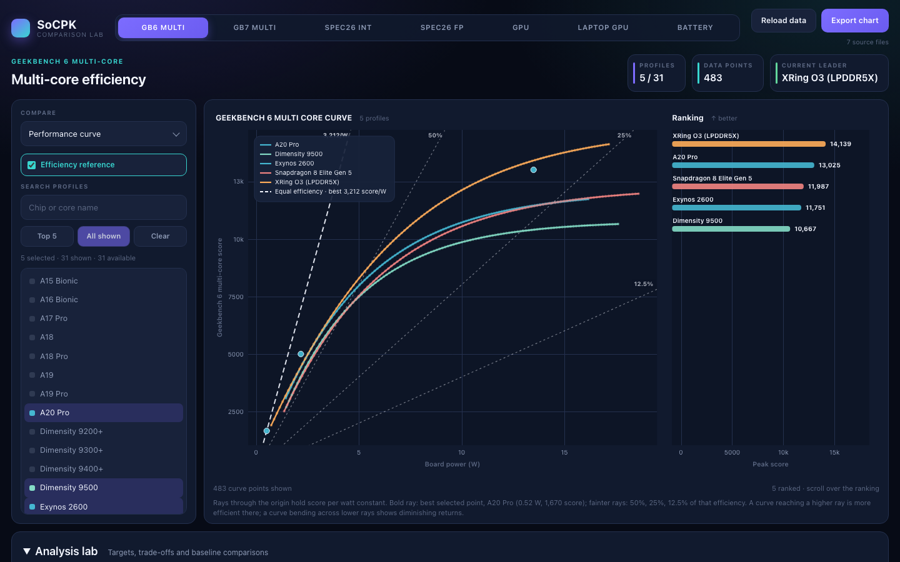
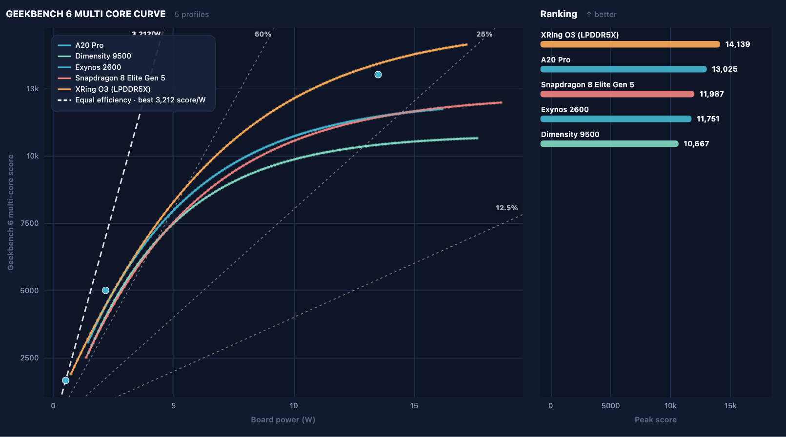
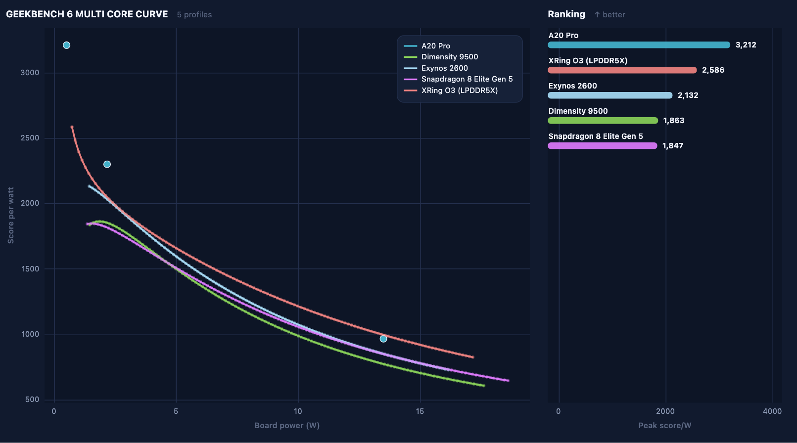
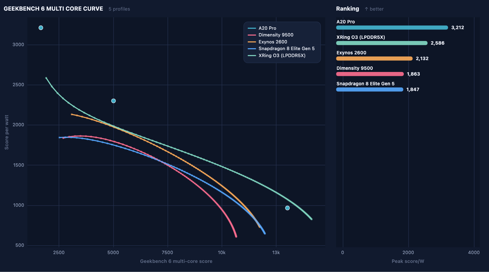
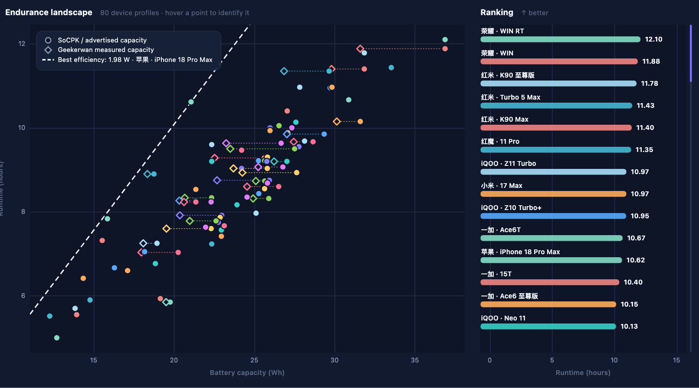
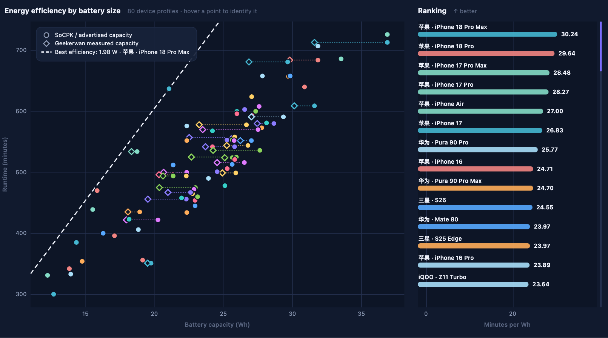
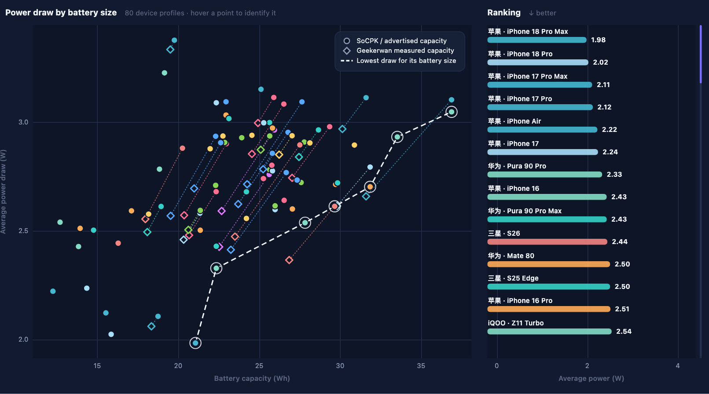
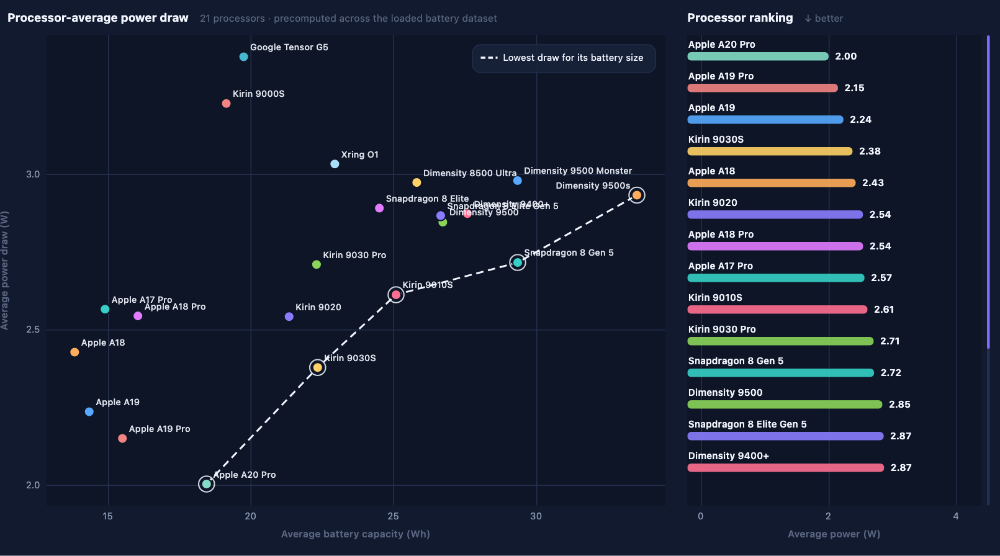
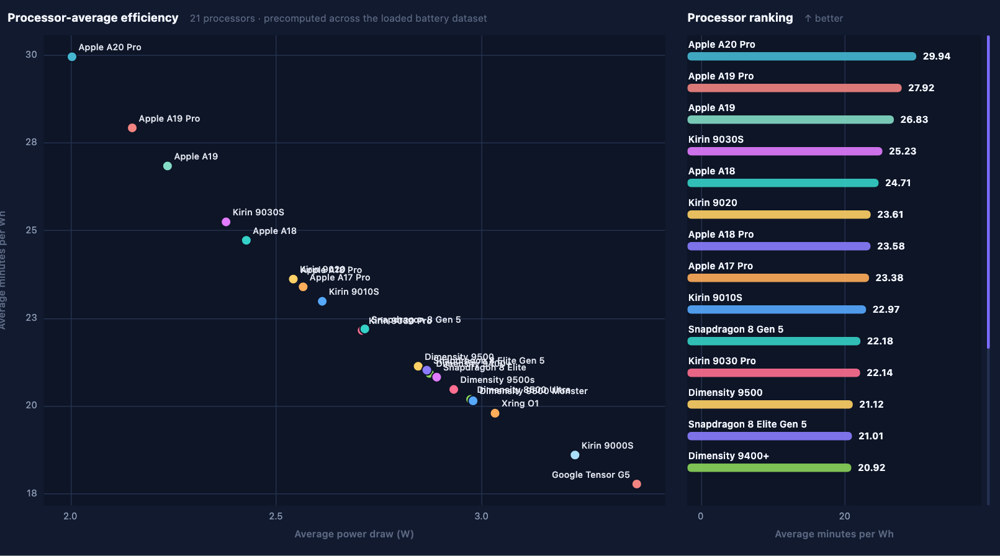

# GKWSocpk

Scrapes [socpk.com](https://socpk.com) CPU, GPU and battery results into CSV
snapshots and compares them in a local web dashboard.



This is a personal project, not affiliated with socpk.com. Respect the site's
terms of service when using it.

## Setup

Python 3.13.

```powershell
py -3.13 -m venv .venv
.\.venv\Scripts\Activate.ps1          # bash/macOS: source .venv/bin/activate
python -m pip install -r requirements.txt
```

`requirements.lock.txt` pins a known-good environment if you need an exact
reproduction.

## 1. Collect data

```powershell
python Battery\battery_parser.py --auto-soc
python "Performance Benchmark\cpu_curve_parser.py" --benchmark all
python "Performance Benchmark\gpu_curve_parser.py"
python "Performance Benchmark\laptop_gpu_curve_parser.py"
```

Snapshots are written to `snapshots/`:

| File | Contents |
| --- | --- |
| `cpu_gb6_curves.csv` | Geekbench 6 multi-core |
| `cpu_gb7_curves.csv` | Geekbench 7 multi-core |
| `cpu_spec2026_int_curves.csv` | SPEC CPU 2026 integer, per core |
| `cpu_spec2026_fp_curves.csv` | SPEC CPU 2026 floating-point, per core |
| `gpu_snl_curves.csv` | Phone GPU, 3DMark Steel Nomad Light |
| `laptop_gpu_curves.csv` | Laptop GPU, 3DMark Time Spy |
| `battery_results.csv` | Battery test 5.0 runtime, capacity and power |

Existing files are never overwritten. If a name is already taken, the new
snapshot gets a timestamp suffix, and the dashboard loads the newest one.

Useful options:

- **CPU:** `--benchmark GB6|GB7|SPEC2026_INT|SPEC2026_FP|all`, `--cpus "A19 Pro"`,
  `--core-group super|large|medium|small`
- **GPU:** `--gpus` to limit which GPUs are scraped
- **Battery:** `--auto-soc` looks up each phone's processor on GSMArena and caches
  the result in `.gsm_cache/`. `--spec-offline` reuses only that cache, and
  `--spec 'Brand|Model=url'` fixes a single phone by hand.

Run any script with `--help` for the full list of options.

## 2. Open the dashboard

```powershell
python socpk_web.py
```

This opens the dashboard in your browser. It runs only on `127.0.0.1`, and
nothing is uploaded. Stop it with Ctrl-C.

Each tab is one dataset: GB6 MULTI, GB7 MULTI, SPEC26 INT, SPEC26 FP, GPU,
LAPTOP GPU and BATTERY. Pick a chart from **Compare**, then choose profiles in
the list on the left. You can click to toggle a profile, shift-click to select a
range, or use **Top 5**, **All shown** and **Clear**. Every chart has a ranking
panel on its right, and hovering over a point shows its details. **Export chart**
saves the chart as PNG or SVG.

The **Efficiency reference** switch draws the dashed guide lines described
below. The note under the chart explains the line currently shown.

## Performance charts (CPU and GPU)

All six CPU and GPU tabs offer the same three charts. Each curve is one chip,
or one core on the SPEC tabs.

| Performance curve | Efficiency curve | Efficiency vs score |
| --- | --- | --- |
|  |  |  |
| Score vs power (W) | Score per watt vs power (W) | Score per watt vs score |
| Ranked by peak score | Ranked by peak score/W | Ranked by peak score/W |

- **Performance curve:** how much performance a chip delivers at each power
  level. Higher and further to the left is better. The dashed rays from the
  origin mark constant score per watt. The bold ray passes through the best
  selected point, and the faint rays mark 50%, 25% and 12.5% of that efficiency.
- **Efficiency curve:** how efficiency changes as power rises. It usually peaks
  at low power and falls as the chip is pushed harder.
- **Efficiency vs score:** the efficiency needed to reach a given score. It is
  the most direct way to compare chips at equal performance.

The points are the values SoCPK publishes, and some of them are fitted upstream.
Apple chips publish only a few points each, so their curves are sparse.

On SPEC tabs, **Filter cores** narrows the list by core group (Super, Large,
Medium, Small) or by core name.

## Battery charts

Every phone has one runtime from SoCPK's battery test 5.0 and one battery
capacity in Wh, taken from the battery imprint. The charts derive two numbers
from these:

- **Average power (W)** = capacity (Wh) ÷ runtime (h). Lower is better.
- **Efficiency (min/Wh)** = runtime (minutes) ÷ capacity (Wh). Higher is better.

These figures describe the whole phone, including the screen, modem and
software, and not the chip alone.

On the device charts, hollow diamonds show Geekerwan's measured usable
capacity where it is available, joined to the SoCPK point by a dotted line. These
measurements are for reference only and never affect the rankings. Turn them
off with **Geekerwan measured capacity**.

### Runtime vs capacity



This chart shows runtime in hours against battery size and ranks phones by
runtime. The dashed line shows the runtime a phone of each battery size would
reach at the power draw of the most efficient selected phone. Phones close to
the line use their battery well.

### Energy efficiency



This chart uses the same layout with runtime in minutes, and ranks phones by
**minutes per Wh**. That ranking separates efficiency from battery size, so a
small phone can rank above a large one.

### Average power draw



This chart shows average power draw against battery size and ranks phones from
the lowest draw. The dashed line connects the ringed phones. For each of them,
no other selected phone has a bigger battery and a lower power draw.

### Processor averages

When the snapshot was collected with `--auto-soc`, the left panel gains a
**Processors** tab. Each processor is the plain average of the phones that use
it, so each phone counts once. Phones whose chip could not be identified with
confidence are left out.

| SoC Average Power Draw | SoC Average Efficiency |
| --- | --- |
|  |  |
| Average W vs average battery Wh, ranked by lowest W | Average min/Wh vs average W, ranked by highest min/Wh |

On the device charts, **Overlay average lines** draws one labelled line for
each selected processor.

## Analysis lab

The **Analysis lab** panel below the chart works on the selected profiles.

- **CPU and GPU tabs:**
  - score at a chosen wattage, and the power needed to reach a target score
  - power needed for 80–100% of peak performance
  - the Pareto frontier
  - a baseline comparison between chip generations
- **Battery tab:**
  - phone power grouped by processor, with brand and screen filters
  - a runtime comparison split into a battery-size effect and a power effect

Values between published points are interpolated linearly, and nothing is
extrapolated beyond them. Click a column heading to sort the table, and use
**Export analysis CSV** to save the tables.

`battery_metadata.json` holds reviewed corrections to phone metadata, such as
chipset, screen size and refresh rate. They are applied when data is loaded
and never change runtime or capacity.

## Dashboard options

```powershell
python socpk_web.py --dataset Battery              # open on a given tab
python socpk_web.py --csv snapshots\gpu_snl_curves.csv
python socpk_web.py --port 0 --no-browser          # any free port, no browser
python socpk_web.py --https                        # for Safari with HTTPS-Only
python socpk_web.py --browser chrome
```

- **Safari:** with HTTPS-Only turned on, Safari refuses plain `http://localhost`.
  Use `--https`, which creates a self-signed local certificate, or open the
  dashboard in another browser.
- **Tk fallback:** `socpk_gui.py` is a slower desktop fallback with the same
  datasets and charts, for machines without a usable browser. It does not
  include the Analysis lab.
- **Keyboard:** `[` and `]` switch tabs, and `/` focuses the search box.

## Other scripts

- `Performance Benchmark\curve_analysis.py --input <csv> --save` plots per-chip
  power, score and efficiency statistics and writes `curve_summary.csv`.
- `analysis/battery_blog_audit.py` reproduces the numbers in the battery
  write-up offline.

## Checking changes

```sh
python tests/smoke.py
```

This compiles every source file, starts the dashboard in-process and checks
that its pages and API respond. It prints `SMOKE OK` on success.
